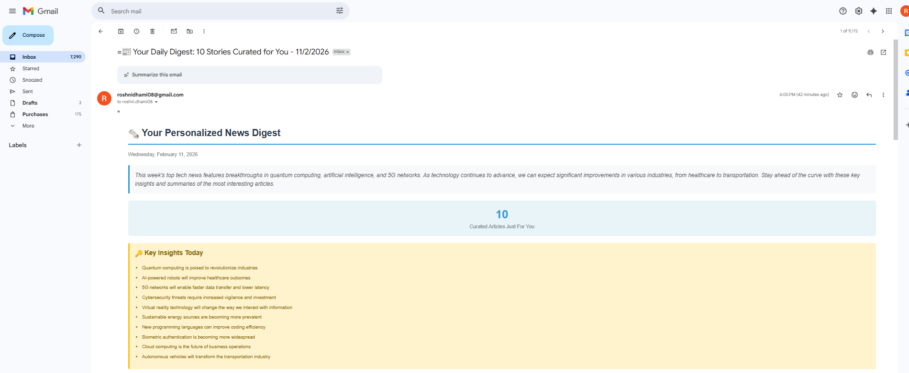

# Ai-news-digest
# 🤖 AI-Powered News Digest

Automate your daily tech news with n8n and Groq AI. Get personalized, AI-curated news digests delivered to your inbox every morning.

## 📸 Preview



## ✨ What It Does

- 📰 Aggregates news from 5+ tech RSS feeds
- 🤖 AI filters to your top 10 most relevant articles using Groq
- ✍️ Generates smart summaries and key insights
- 📧 Sends beautiful HTML email digest daily
- ⏱️ **Saves 4+ hours per week** of manual reading

## 🛠️ Tech Stack

- **n8n** - Workflow automation
- **Groq API** - AI filtering (Llama 3.3 70B)
- **Gmail** - Email delivery
- **RSS Feeds** - News sources

## 🚀 Quick Setup (5 Minutes)

### Prerequisites

- n8n installed ([self-hosted](https://docs.n8n.io/hosting/) or [cloud](https://n8n.io))
- Free Groq API key from [console.groq.com](https://console.groq.com)
- Gmail account

## 📋 RSS Feeds Included

- Wired
- TechCrunch AI
- Ycombinator
- Google RSS
- Mashable
- MIT News

## ⚙️ Customization

### Change Interests

Edit the "Set" node:
```javascript
userInterests: "Your topics here"
excludeTopics: "Topics to avoid"
maxArticles: 10
```

### Change Schedule

Edit the "Schedule Trigger" node:
- Change time (default: 8:00 AM)
- Change days (default: Daily)

### Add More RSS Feeds

1. Copy any RSS Feed node
2. Paste it
3. Change the URL
4. Connect to Merge node

### Change AI Model

In HTTP Request node, change:
```json
"model": "llama-3.3-70b-versatile"
```

To any [Groq model](https://console.groq.com/docs/models):
- `mixtral-8x7b-32768` - Faster, cheaper
- `llama-3.3-70b-versatile` - Best quality (recommended)

## 📊 How It Works
```
RSS Feeds (100+ articles)
    ↓
Merge All Sources
    ↓
Format Articles
    ↓
Your Preferences
    ↓
Groq AI Filters → Top 10 Articles
    ↓
Sort by Relevance
    ↓
Generate HTML Email
    ↓
Send to Gmail ✉️
```

## 🎯 Example Email Output

**Subject:** 📰 Your Daily Digest: 10 Articles - February 12, 2025

**Content:**
- Digest intro (AI-generated)
- 3 key insights from all articles
- 10 articles sorted by relevance (8-10 score)
  - Each with AI summary
  - Source and date
  - Direct link to article

## 🐛 Troubleshooting

**Only getting 2 articles?**
- Update Groq prompt to say "select exactly 10 articles"
- Check Parse Response takes first 10 regardless

**Getting [object Object] in email?**
- Update Parse Response to convert objects to strings
- See code in workflow.json

**Email not sending?**
- Check Gmail credentials
- Verify Gmail node is configured
- Test with Execute Workflow button

## 📈 Performance

- **Execution Time:** ~30 seconds
- **Articles Scanned:** 100-120 per day
- **Articles Delivered:** 10 most relevant
- **Filtering Rate:** ~90%
- **Time Saved:** 4-6 hours per week


**Built with:**
- [n8n](https://n8n.io) - Workflow automation
- [Groq](https://groq.com) - AI inference

